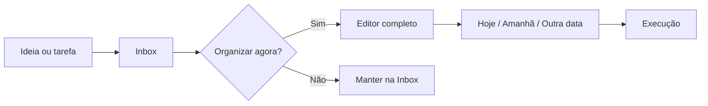
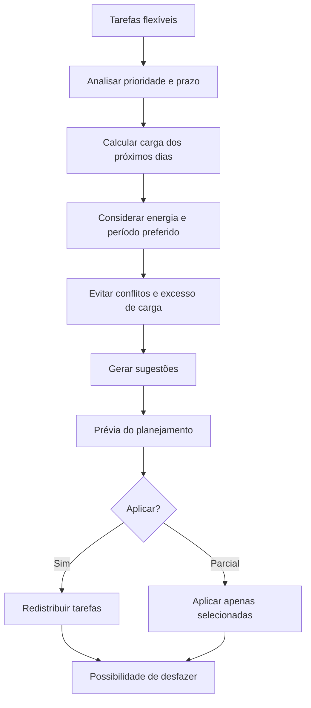
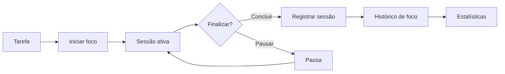
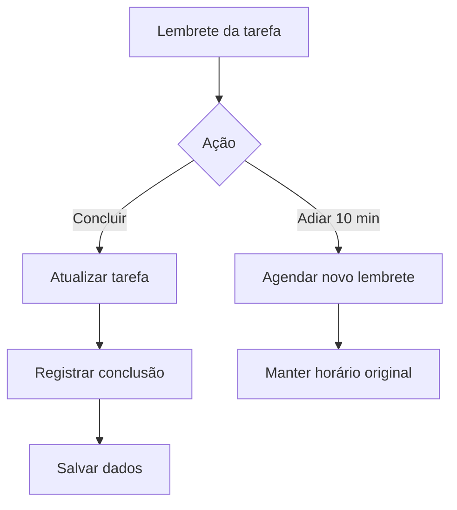
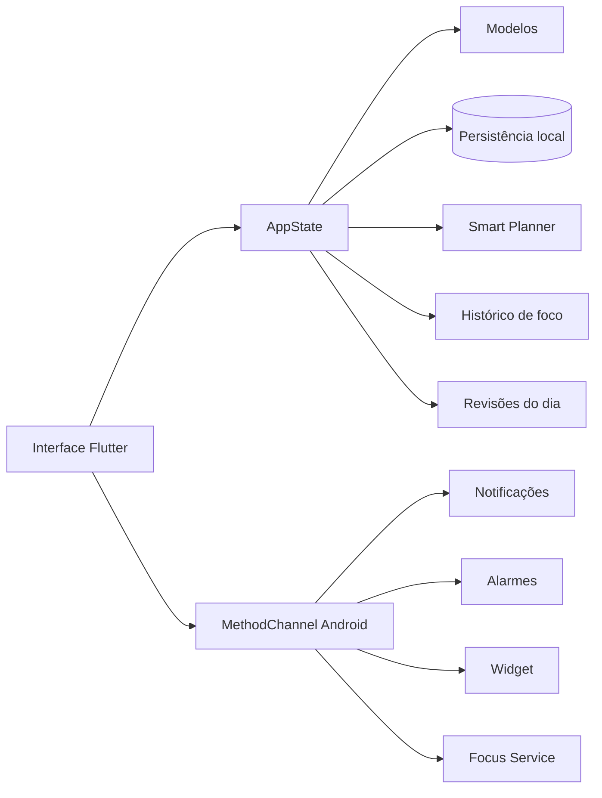

<div align="center">

# ⏱️ Ritmo

### Seu Productivity OS para organizar tarefas, hábitos, foco, metas, projetos e planejamento em um só lugar.


[](https://github.com/VictorAms12/RitmoAndroid/actions/workflows/build-apk.yml)
[](https://github.com/VictorAms12/RitmoAndroid/actions/workflows/build-windows.yml)

**Offline-first • Multiplataforma • Focado em produtividade pessoal**

</div>

---

## 📖 Sobre o projeto

**Ritmo** é um aplicativo de produtividade desenvolvido em Flutter para centralizar tarefas, hábitos, metas, projetos, compromissos, planejamento e sessões de foco sem exigir conta online ou conexão permanente com a internet.

O projeto nasceu como um organizador pessoal e evoluiu para uma espécie de **Productivity OS**: em vez de apenas armazenar listas, o Ritmo tenta conectar tudo que acontece entre capturar uma ideia, organizar a rotina, decidir o que fazer, executar e acompanhar o próprio progresso.

A proposta é organizar o ciclo de produtividade pessoal completo:

**capturar → organizar → planejar → executar → revisar**.

Os dados permanecem armazenados localmente no dispositivo, mantendo o aplicativo funcional mesmo offline.

> Versão atual: **3.4.2 — Android + Windows**

---

## ✨ Destaques

| Área | O que o Ritmo entrega |
|---|---|
| 🏠 **Hoje** | Resumo do dia, tarefas, hábitos, atrasos, progresso, foco e fechamento diário |
| 📥 **Inbox** | Captura rápida de tarefas sem exigir data, horário ou projeto imediatamente |
| 🧠 **Smart Planner 2.0** | Distribuição inteligente de tarefas flexíveis com prévia e justificativas |
| 🗓️ **Agenda** | Calendário mensal, timeline diária, compromissos e planejamento por horário |
| 📋 **Kanban** | Fluxo visual de tarefas com drag-and-drop entre estados |
| 🎯 **Metas e projetos** | Organização por objetivos, projetos, prazos e subtarefas |
| 🔁 **Hábitos** | Rotinas recorrentes, horários, histórico e streak |
| ⏱️ **Foco** | Pomodoro, sessões personalizadas e histórico de tempo focado |
| 📊 **Progresso** | Estatísticas, consistência, heatmap, histórico e distribuição por categoria |
| 🔔 **Notificações** | Lembretes Android com ações rápidas para concluir ou adiar tarefas |
| 🎨 **Experiência** | Light/Dark Mode, interface responsiva e adaptação mobile/desktop |

---

## 🏠 Tela Hoje

A tela inicial funciona como o centro operacional da rotina.

Ela reúne as informações mais úteis do momento sem exigir que o usuário navegue por várias telas:

- progresso combinado do dia;
- tarefas organizadas por período;
- hábitos programados;
- tarefas atrasadas;
- minutos planejados;
- minutos de foco realizados;
- acesso rápido à Central;
- fechamento diário;
- humor e observações do dia.

A ideia é responder rapidamente a três perguntas:

**O que tenho para fazer? O que já fiz? O que merece atenção agora?**

---

## 📥 Caixa de Entrada

A **Inbox** permite capturar algo rapidamente sem precisar decidir tudo no mesmo instante.

Uma nova tarefa pode ser registrada primeiro e organizada depois com:

- data;
- horário;
- prazo;
- prioridade;
- duração estimada;
- categoria;
- projeto;
- energia necessária;
- período preferido;
- flexibilidade para planejamento automático.



A Inbox funciona como uma etapa de captura, evitando que o processo de registrar uma tarefa interrompa o que o usuário está fazendo.

---

## 🧠 Smart Planner 2.0

O **Smart Planner** é uma das principais camadas de inteligência do Ritmo.

Em vez de simplesmente mover tarefas para qualquer espaço disponível, o planejador considera diferentes fatores antes de sugerir uma distribuição:

- prioridade;
- prazo;
- duração prevista;
- duração histórica de sessões de foco;
- energia necessária;
- período preferido do dia;
- capacidade diária configurada;
- compromissos e tarefas fixas;
- hábitos com horário;
- uso opcional de fins de semana.

O fluxo de planejamento funciona assim:



Antes de alterar a agenda, o app mostra uma **prévia** e informa o motivo de cada sugestão.

O usuário pode:

- aceitar todas as sugestões;
- aplicar apenas algumas;
- cancelar o planejamento;
- desfazer o último planejamento.

### Regras de segurança

O planejador não deve mover automaticamente:

- tarefas concluídas;
- tarefas recorrentes;
- compromissos fixos;
- itens ainda mantidos na Inbox.

Somente tarefas marcadas como **flexíveis** participam da distribuição automática.

---

## 🗓️ Agenda e planejamento diário

A agenda reúne diferentes formas de visualizar a rotina.

### Calendário mensal

Permite navegar entre datas e identificar rapidamente onde estão concentradas as tarefas e compromissos.

### Timeline diária

A timeline organiza os acontecimentos do dia por horário, ajudando a visualizar:

- tarefas;
- hábitos;
- compromissos;
- sessões planejadas;
- horários livres.

Essa visão complementa o Smart Planner porque transforma uma simples lista em uma representação mais próxima da agenda real do usuário.

---

## 📋 Kanban

O Ritmo também oferece organização visual em Kanban.

As tarefas podem ser movimentadas entre estados como:

**A fazer → Em andamento → Concluído**

O drag-and-drop facilita reorganizar o fluxo sem precisar abrir cada tarefa individualmente.

Essa visualização é especialmente útil para projetos, estudos, trabalhos pessoais e atividades que possuem várias etapas.

---

## 🎯 Projetos, metas e subtarefas

### Projetos

Projetos agrupam tarefas relacionadas a um objetivo maior e podem possuir:

- título;
- descrição;
- prazo;
- tarefas relacionadas.

### Metas

As metas oferecem acompanhamento de progresso e prazo.

Podem ser utilizadas para representar objetivos pessoais, acadêmicos ou profissionais.

### Subtarefas

Tarefas maiores podem ser quebradas em etapas menores, reduzindo a necessidade de criar vários itens independentes.

---

## 🔁 Hábitos e rotinas

O Ritmo trata hábitos como parte da agenda, e não como um sistema isolado.

Cada hábito pode possuir informações como:

- frequência;
- dias específicos;
- horário;
- duração;
- categoria;
- histórico de conclusão.

Os hábitos aparecem junto do planejamento diário e participam do cálculo de progresso.

O histórico permite acompanhar consistência e sequência de dias concluídos.

---

## ⏱️ Modo Foco

O Ritmo possui um sistema de foco para transformar planejamento em execução.

É possível utilizar:

- Pomodoro;
- sessões personalizadas;
- pausa;
- retomada;
- histórico de sessões;
- minutos focados por dia;
- relação entre tempo planejado e executado.

No Android, o timer utiliza serviço nativo para continuar funcionando corretamente mesmo quando o aplicativo fica em segundo plano.



---

## 📊 Progresso e estatísticas

A área de progresso transforma os dados registrados durante o uso em indicadores da rotina.

Ela reúne informações como:

- produtividade semanal;
- conclusão de tarefas;
- histórico recente;
- minutos de foco;
- consistência;
- heatmap de atividade;
- distribuição por categoria;
- streak de hábitos;
- comparação entre planejamento e execução.

O objetivo não é apenas mostrar números, mas ajudar a perceber padrões de organização e execução.

---

## 🔔 Notificações Android

As notificações de tarefas possuem ações rápidas sem exigir a abertura do aplicativo.

### Concluir

Marca a tarefa como concluída e registra a conclusão no histórico.

### Adiar 10 min

Agenda um novo lembrete sem alterar permanentemente o horário original da tarefa.



Na v3.4.2, a camada nativa Android foi alinhada ao **schema 8** para que ações realizadas pela própria notificação preservem os campos utilizados pelo Smart Planner, incluindo:

- `inbox`;
- `energy`;
- `preferredPeriod`.

> O Android pode flexibilizar alarmes em modo de economia de bateria. Por isso, o adiamento funciona como lembrete e não deve ser tratado como um despertador de precisão absoluta.

---

## 🖥️ Android e Windows

A partir da versão 3.4.2, Android e Windows compartilham a mesma base Flutter.

### Android

A versão mobile utiliza:

- navegação inferior;
- botão central para novas ações;
- notificações nativas;
- widget;
- lembretes agendados;
- timer de foco em foreground/background;
- integração Flutter ↔ Android por `MethodChannel`.

### Windows

Em telas largas, a interface troca automaticamente a navegação inferior por uma **Navigation Rail lateral**, aproveitando melhor o espaço horizontal de notebooks e desktops.

A navegação lateral inclui:

- Hoje;
- Agenda;
- Progresso;
- Ajustes;
- botão rápido de adicionar.

O build Windows é distribuído atualmente como pacote portátil ZIP contendo `Ritmo.exe` e suas dependências.

> Android e Windows ainda utilizam bases locais independentes. Sincronização entre dispositivos faz parte da evolução planejada.

---

## 🎨 Interface e experiência

O Ritmo utiliza **Material 3** com um design system próprio e responsivo.

### Tema escuro

- preto e grafite como base;
- superfícies em diferentes níveis de cinza;
- índigo como cor principal;
- cores semânticas reservadas para estados e alertas.

### Tema claro

- branco e cinza frio;
- hierarquia visual limpa;
- contraste elevado para informações importantes;
- índigo como identidade principal.

A interface foi pensada para funcionar tanto em celulares quanto em telas maiores sem simplesmente ampliar o layout mobile.

O projeto utiliza:

- tema claro;
- tema escuro;
- modo seguindo o sistema;
- animações de navegação;
- microinterações;
- cards arredondados;
- estados vazios;
- feedback visual;
- layout adaptativo;
- navegação mobile e desktop.

---

## 🏗️ Arquitetura

O Ritmo segue uma abordagem **offline-first**, com estado centralizado e persistência local.



A maior parte da aplicação é compartilhada entre Android e Windows.

Recursos específicos do sistema operacional ficam isolados na camada nativa, evitando que regras do Android contaminem a lógica multiplataforma principal.

---

## 🧰 Tecnologias

| Tecnologia | Uso |
|---|---|
| **Flutter** | Interface e aplicação multiplataforma |
| **Dart** | Linguagem principal |
| **Material 3** | Design system e componentes |
| **SharedPreferences** | Persistência local atual |
| **Java / Android SDK** | Alarmes, notificações, widget e serviços Android |
| **MethodChannel** | Comunicação Flutter ↔ Android nativo |
| **CMake** | Build da aplicação Windows |
| **Gradle** | Build e assinatura Android |
| **GitHub Actions** | CI e geração automática de builds |

Versão mínima do SDK Dart definida pelo projeto: **3.10.0**.

---

## 📁 Estrutura principal

```text
RitmoAndroid/
├── .github/
│   └── workflows/
│       ├── build-apk.yml
│       └── build-windows.yml
├── android/
│   └── app/src/main/
│       ├── java/com/ritmo/mobile/
│       │   ├── MainActivity.java
│       │   ├── Store.java
│       │   ├── FocusTimerService.java
│       │   ├── ReminderReceiver.java
│       │   ├── ReminderScheduler.java
│       │   ├── BootReceiver.java
│       │   └── RitmoWidgetProvider.java
│       └── res/
├── lib/
│   ├── core/             # Estado, tema e integração nativa
│   ├── models/           # Modelos e serialização
│   ├── screens/          # Telas principais
│   ├── services/         # Smart Planner e regras de domínio
│   ├── sheets/           # Editores e bottom sheets
│   ├── widgets/          # Componentes reutilizáveis
│   └── main.dart
├── windows/              # Runner Flutter para Windows
├── pubspec.yaml
├── CHANGELOG.md
└── README.md
```

---

## 💾 Dados e compatibilidade

### Android

O identificador do aplicativo continua sendo:

```text
com.ritmo.mobile
```

A série Flutter mantém compatibilidade com a estrutura de dados utilizada pelas versões anteriores.

Os dados principais ficam em:

```text
SharedPreferences: ritmo_prefs
chave: ritmo_data
schemaVersion: 8
```

No Android, o Flutter acessa a camada nativa através de `MethodChannel`, permitindo que notificações, widget e serviços utilizem a mesma base de dados do aplicativo.

### Windows

No Windows, a implementação desktop do `shared_preferences` mantém os dados no perfil local do usuário.

Atualmente, Android e Windows possuem bases independentes.

---

## 🚀 Executando o projeto

### Pré-requisitos

- Flutter Stable;
- Dart compatível com o `pubspec.yaml`;
- Android SDK para build Android;
- Visual Studio com **Desktop development with C++** para build Windows.

### Clonar

```bash
git clone https://github.com/VictorAms12/RitmoAndroid.git
cd RitmoAndroid
```

### Instalar dependências

```bash
flutter pub get
```

### Executar

Android ou dispositivo conectado:

```bash
flutter run
```

Windows:

```bash
flutter config --enable-windows-desktop
flutter run -d windows
```

---

## 📦 Builds de release

### Android

```bash
flutter build apk --release
```

O projeto também possui workflow próprio para geração do APK assinado utilizado nas releases internas.

Artifact esperado:

```text
Ritmo-v3.4.2-APK
└── Ritmo-v3.4.2.apk
```

### Windows

```bash
flutter build windows --release
```

Artifact esperado:

```text
Ritmo-v3.4.2-Windows
└── Ritmo-v3.4.2-Windows.zip
```

O executável depende das DLLs e da pasta `data` presentes no pacote. Para distribuição portátil, mantenha todos os arquivos juntos.

---

## ⚙️ CI com GitHub Actions

O repositório possui pipelines independentes para Android e Windows.

### Android

```text
.github/workflows/build-apk.yml
```

### Windows

```text
.github/workflows/build-windows.yml
```

O fluxo geral de CI é:

```text
Checkout
↓
Setup Flutter
↓
flutter pub get
↓
flutter analyze
↓
Build Release
↓
Empacotamento
↓
Upload do artifact
```

Os resultados ficam disponíveis em:

**Actions → execução do workflow → Artifacts**.

---

## 🔐 Dados e privacidade

Na versão 3.4.2, os dados do Ritmo são armazenados localmente no dispositivo.

Isso significa que:

- o aplicativo funciona offline;
- não existe conta obrigatória;
- não existe envio automático das tarefas para um servidor;
- Android e Windows mantêm bases locais independentes;
- remover os dados locais pode apagar as informações armazenadas.

Uma futura camada de sincronização deverá preservar o princípio **offline-first**, mantendo o aplicativo utilizável mesmo sem conexão.

---

## ⚠️ Limitações atuais

- sincronização Android ↔ Windows ainda não está disponível;
- não há backup automático em nuvem;
- notificações completas são atualmente específicas do Android;
- o widget está disponível apenas no Android;
- o timer em background possui integração nativa completa no Android;
- o Windows é distribuído atualmente como aplicação portátil, sem instalador MSIX;
- atalhos de teclado dedicados ainda podem ser ampliados.

---

## 🛣️ Roadmap

### Próximos passos planejados

- [ ] sincronização segura Android ↔ Windows;
- [ ] pareamento de dispositivos por QR Code ou código;
- [ ] sincronização dentro da rede local;
- [ ] sincronização remota opcional;
- [ ] fila de alterações offline-first;
- [ ] backup e restauração;
- [ ] notificações nativas completas no Windows;
- [ ] instalador / empacotamento MSIX;
- [ ] recorrências avançadas;
- [ ] dependências entre tarefas;
- [ ] dashboard personalizável;
- [ ] atalhos de teclado para desktop;
- [ ] evolução contínua do Smart Planner;
- [ ] melhorias de acessibilidade, desempenho e UX.

---

## 🧪 Qualidade

Os workflows executam análise estática antes da geração dos artifacts:

```bash
flutter analyze --no-fatal-infos --no-fatal-warnings
```

A versão 3.4.2 possui builds automatizados e validados para **Android** e **Windows** através do GitHub Actions.

---

## 📌 Versão atual

```text
Ritmo 3.4.2
versionCode: 14
schemaVersion: 8
Flutter: 3.44.4
Android + Windows
```

---

## 👨‍💻 Autor

Desenvolvido e mantido por **VictorAms12**.

GitHub: [@VictorAms12](https://github.com/VictorAms12)

---

<div align="center">

**Ritmo** — produtividade que acompanha o seu dia, não apenas a sua lista de tarefas.

</div>
